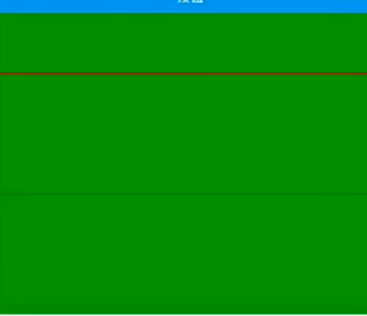

# PixelRatio

## 获取像素密度

```js
PixelRatio.get();
// 等同于
Dimensions.get("screen").scale;

// 只针对于安卓 ，ios值是一样的
PixelRatio.getFontScale() === Dimensions.get("screen").fontScale;
```

## 获取设备像素密度

Converts a layout size (dp) to pixel size (px). Guaranteed to return an integer number.
将布局大小(dp)转换为像素大小(px)。保证返回一个整数。

```js
PixelRatio.getPixelSizeForLayoutSize(100);
// 等同于
100 * PixelRatio.get();
```

## 获取就近值 roundToNearestPixel

特殊场景的救命稻草


```jsx
<View
  style={{
    width: "100%",
    backgroundColor: "red",
  }}
>
  <View
    style={{
      width: "100%",
      height: PixelRatio.roundToNearestPixel(32.1),
      backgroundColor: "green",
    }}
  />
  * 10
</View>
```
