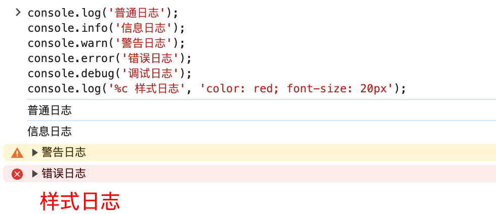
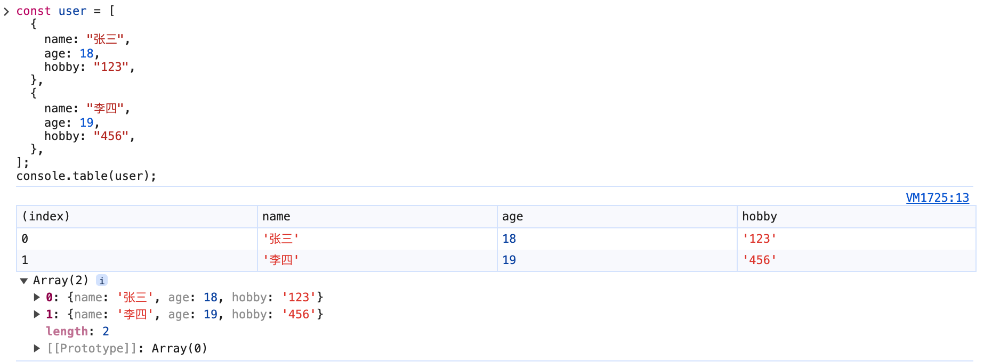
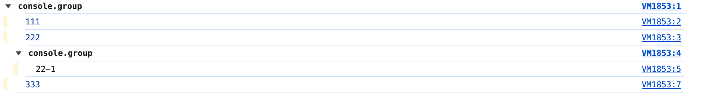

# console

## 简单 log

```js
console.log("普通日志");
console.info("信息日志");
console.warn("警告日志");
console.error("错误日志");
console.debug("调试日志");
console.log("%c 样式日志", "color: red; font-size: 20px");
```



## 组件 log

```jsx
const view = (
  <View>
    <Text style={{ fontSize: "20px", color: "red" }}>123</Text>
  </View>
);
console.log(view, "view");
```


## table log

```jsx
const user = [
  {
    name: "张三",
    age: 18,
    hobby: "123",
  },
  {
    name: "李四",
    age: 19,
    hobby: "456",
  },
];
console.table(user);
```



## group log

```jsx
console.group();
console.log(111);
console.log(222);
console.group();
console.log(22 + "-" + 1);
console.groupEnd();
console.log(333);
console.groupEnd();
```


