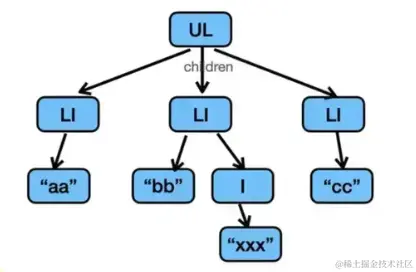

## React.createElement 和 render function

`React.createElement` 返回一个 `React Element`，类似于 `vdom` 。 

之前写 React 组件都必须有一行 `import * as React from 'react'`，因为编译后会用到 React 的 api。 

但后来改为了这种 `render function`之后

`JSX` 通过`babel`、`tsc`等编译器编译成 `render function`，然后执行后产生 `React Element` 的树。

由 `babel`、`tsc` 等编译工具自动引入一个 `react/jsx-runtime` 的包，然后 `render function` 执行后产生 `React Element` 对象，也就是常说的 `虚拟dom`。

## vdom 和 fiber

`vdom` （React Element）是一个通过 children 串联起来的树 。

`fiber` 是一个数据结构，用来描述一个节点，它包含节点的属性、节点的子节点、父节点、兄弟节点、 Effect 链表、更新队列、其他一些状态。

## react 渲染原理

React Element 的树会转成 fiber 链表，这个过程叫做 reconcile，由 React 的 Scheduler 调度。

reconcile 每次只处理一个 fiber 节点，通过时间分片把 reconcile 的过程分到多个任务跑，这样 fiber 树再大也不会阻塞渲染。

reconcile + schedule 这个过程叫做 render 阶段，而之后会进入 commit 阶段。

commit 阶段会遍历构建好的 fiber 链表，执行 dom 操作，还有函数组件的 effect 等。

它按照更新 dom 前后，分了 before mutation、mutation、layout 三个小阶段。
