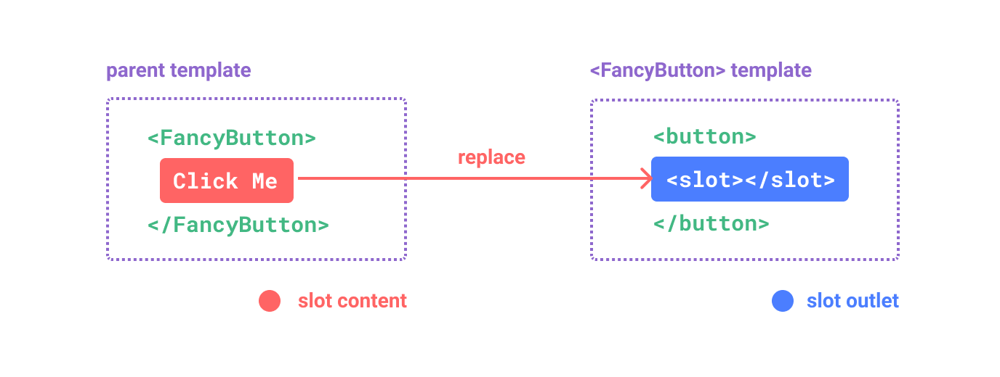

## 父传子

- 父组件通过 `v-bind` 传递值
- 子组件通过 `defineProps` 接受值，并使用 `withDefaults` 设置默认值
- `withDefaults` 仅在 `typescript` 环境中使用

```vue
<!-- 父组件 -->
<template>
  <div>
    <Son :num="1234" :arr="[1, 2]"></Son>
    <hr />
    父组件
  </div>
</template>

<script setup lang="ts">
import Son from "@/components/Son.vue";
</script>
```

```vue
<!-- 子组件 -->
<template>
  <div>子组件--{{ num }} --- {{ arr }}</div>
</template>

<script setup lang="ts">
withDefaults(
  defineProps<{
    num: number;
    arr?: number[];
  }>(),
  {
    arr: () => [4, 5, 6],
  }
);
</script>
```

## 子传父

### case 1

- 子组件通过 `defineEmits` 定义事件 ， 并通过 `emit` 触发事件

```vue
<!-- 子组件 -->
<template>
  <div>子组件</div>
  <button @click="handleSend">子传父</button>
</template>

<script setup lang="ts">
const emit = defineEmits(["on-click"]);

const handleSend = () => {
  emit("on-click", "给父组件传值123~~");
};
</script>
```

```vue
<!-- 父组件 -->
<template>
  <div>
    <Son @on-click="handleClick"></Son>
    <hr />
    父组件
  </div>
</template>

<script setup lang="ts">
import Son from "@/components/Son.vue";

const handleClick = (value: string) => {
  console.log("父组件", value);
};
</script>
```

### case 2 `typescript` 写法

```vue
<template>
  <div>子组件</div>
  <button @click="handleSend">子传父</button>
</template>

<script setup lang="ts">
const emit = defineEmits<{
  (e: "on-click", value: string): void;
}>();

const handleSend = () => {
  emit("on-click", "给父组件传值123~~");
};
</script>
```

## 子组件暴露方法

- 子组件通过 `defineExpose` 来暴露 属性 和方法
- 父组件通过 ref 获取子组件实例，然后通过实例访问子组件暴露的属性和方法

```vue
<!-- 子组件 -->
<template>
  <div>子组件</div>
</template>

<script setup lang="ts">
defineExpose<{
  name: string;
  getName: () => string;
}>({
  name: "子组件名字",
  getName: () => {
    return "子组件方法 --- >  getName";
  },
});
</script>
```

```vue
<!-- 父组件 -->
<template>
  <div>
    <Demo1 ref="sonRef"></Demo1>
    <hr />
    父组件
  </div>
</template>

<script setup lang="ts">
import Demo1 from "@/components/Demo1.vue";
import { onMounted, ref } from "vue";
const sonRef = ref<InstanceType<typeof sonRef | null>>(null);

onMounted(() => {
  if (sonRef.value) {
    console.log(sonRef.value.name, "sonRef"); // 访问 name 的值
    console.log(sonRef.value.getName(), "sonRef"); // 调用 getName 方法
  }
});
</script>
```

## 全局组件

- 全局组件不支持 `tree-shaking` ，`全局组件` 无论使用与否都会被打包到 JS 文件中
- 全局组件依赖不明确，后期难维护

```ts
// main.ts
import { createApp } from "vue";
import App from "./App.vue";
import ComponentA from "./components/ComponentA.vue";

const app = createApp(App);
app.component("ComponentA", ComponentA);
app.mount("#app");
```

## 局部组件

- 局部注册的组件需要在使用它的父组件中显式导入，组件之间的依赖关系更加明确，支持 `tree-shaking`
- 在使用 `<script setup>` 的单文件组件中，导入的组件可以直接在模板中使用，无需注册
- 请注意：局部注册的组件在后代组件中不可用。在这个例子中，ComponentA 注册后仅在当前组件可用，而在任何的子组件或更深层的子组件中都不可用。

```vue
<template>
  <ComponentA />
</template>

<script setup>
import ComponentA from "./ComponentA.vue";
</script>
```

- 如果没有使用 `<script setup>`，则需要使用 components 选项来显式注册：

```js
import ComponentA from "./ComponentA.js";

export default {
  components: {
    ComponentA,
  },
  setup() {},
};
```

## 动态组件

动态组件指的是动态切换组件的显示与隐藏

### 基本使用

- 在 `Vue2` 的时候 `is` 是通过组件名称切换的 在 Vue3 `setup` 是通过组件实例切换的
- 当使用 `<component :is="...">` 来在多个组件间作切换时，被切换掉的组件会被卸载。
- 我们可以通过 `<KeepAlive>` 组件强制被切换掉的组件仍然保持`存活`的状态。

```vue
<template>
  <component :is="flag ? ComponentA : ComponentB"></component>
  <button @click="switchComponent">切换组件</button>
</template>

<script setup lang="ts">
import ComponentA from "./ComponentA.vue";
import ComponentB from "./ComponentB.vue";

const flag = ref(true);

const switchComponent = () => {
  flag.value = !flag.value;
};
</script>
```

### 使用 keep-alive 保持状态

默认情况下，切换动态组件时无法保持组件的状态。此时可以使用 vue 内置的 组件保持动态组件的状态

```vue
<template>
  <keep-alive>
    <component :is="flag ? ComponentA : ComponentB"></component>
  </keep-alive>
</template>
```

### 注意场景

1. 如果你把组件实例放到 Reactive Vue 会给你一个警告 runtime-core.esm-bundler.js:38 [Vue warn]: Vue received a Component which was made a reactive object. This can lead to unnecessary performance overhead, and should be avoided by marking the component with `markRaw` or using `shallowRef` instead of `ref`.
   Component that was made reactive:

- 这是因为 `reactive` 会进行 `proxy` 代理 而我们组件代理之后毫无用处 节省性能开销 推荐我们使用 `shallowRef` 或者 `markRaw` 跳过 `proxy` 代理

```ts
const tab = reactive<Com[]>([
  {
    name: "A组件",
    comName: markRaw(A),
  },
  {
    name: "B组件",
    comName: markRaw(B),
  },
]);
```

## 异步组件

- 仅在需要时加载相关组件，`defineAsyncComponent` 方法来实现此功能

```vue
<script setup>
import { defineAsyncComponent } from "vue";

const CompA = defineAsyncComponent(() => import("./components/ComponentA.vue"));
</script>

<template>
  <CompA />
</template>
```

- 与普通组件一样，异步组件可以使用 `app.component()` 全局注册

```ts
// main.ts
app.component(
  "MyComponent",
  defineAsyncComponent(() => import("./components/MyComponent.vue"))
);
```

## slot

`<slot>` 元素是一个插槽出口 (slot outlet)，标示了父元素提供的插槽内容 (slot content) 将在哪里被渲染。
这里有一个 `<FancyButton>` 组件，可以像这样使用：

```vue
<template>
  <FancyButton>
    Click me!
    <!-- 插槽内容 -->
  </FancyButton>
</template>
```

```vue
<template>
  <button class="fancy-btn">
    <slot></slot>
    <!-- 插槽出口 -->
  </button>
</template>
```



最终渲染出的 DOM 是这样：`<button class="fancy-btn">Click me!</button>`

### 具名插槽

具名插槽允许你在子组件中定义多个插槽，每个插槽都有一个名字，以便在父组件中可以根据名字插入内容。使用 `#插槽名` 的方式来使用具名插槽。

### 条件插槽

条件插槽结合 `v-if` 指令，可以实现条件渲染插槽内容，即根据条件动态决定是否渲染插槽内容。

### 动态插槽名

动态插槽名通过模板语法 `#[插槽名变量]`，可以实现插槽名的动态变化。插槽名变量可以在父组件中动态绑定。

### 作用域插槽

作用域插槽允许子组件将数据传递给父组件，父组件可以使用这些数据来渲染内容。在父组件中，使用 `v-slot` 指令并通过解构方式获取子组件传递的数据。

## Suspense

`<Suspense>` 是一个内置组件，用来在组件树中协调对异步依赖的处理。它让我们可以在组件树上层等待下层的多个嵌套异步依赖项解析完成，并可以在等待时渲染一个加载状态。

```vue
<template>
  <Suspense>
    <!-- 具有深层异步依赖的组件 -->
    <ComponentA />

    <!-- 在 #fallback 插槽中显示 “正在加载中” -->
    <template #fallback>Loading...</template>
  </Suspense>
</template>
```

### 错误处理

可以使用 `errorCaptured` 选项或者 `onErrorCaptured() `钩子，在使用到 `<Suspense>` 的父组件中捕获和处理异步错误。

## Teleport

`<Teleport>` 是一个内置组件，它可以将一个组件内部的一部分模板`传送`到该组件的 DOM 结构外层的位置去。

### 禁用 Teleport

```vue
<template>
  <Teleport :disabled="isMobile"></Teleport>
</template>
```

### 多个 Teleport 共享目标

```vue
<template>
  <Teleport to="#modals">
    <div>A</div>
  </Teleport>
  <Teleport to="#modals">
    <div>B</div>
  </Teleport>
</template>
```

## Transition

`Vue` 提供了两个内置组件，可以帮助你制作基于状态变化的过渡和动画：

https://cn.vuejs.org/guide/built-ins/transition.html#the-transition-component

- `<Transition>` 会在一个元素或组件进入和离开 DOM 时应用动画。
- `<TransitionGroup>` 会在一个 `v-for` 列表中的元素或组件被插入、移动或移除时应用动画。

`<Transition>` 是一个内置组件，这意味着它在任意别的组件中都可以被使用，无需注册。

使用场景包括：

- 由 `v-if` 所触发的切换
- 由 `v-show` 所触发的切换
- 由特殊元素 `<component>` 切换的动态组件
- 改变特殊的 `key` 属性

`<Transition>` 仅支持单个元素或组件作为其插槽内容。如果内容是一个组件，这个组件必须仅有一个根元素。
当一个 `<Transition>` 组件中的元素被插入或移除时，会发生以下事情：

- `Vue` 会自动检测目标元素是否应用了 `CSS` 过渡或动画，并在适当时机添加和移除 `CSS` 过渡类。
- 如果有 `JavaScript` 钩子作为监听器，这些钩子函数会在适当时机被调用。
- 如果没有检测到 `CSS` 过渡或动画，也没有提供 `JavaScript` 钩子，那么 `DOM` 的插入和删除操作将在浏览器的下一个动画帧后执行。

```vue
<template>
  <button @click="show = !show">Toggle</button>
  <Transition>
    <p v-if="show">hello</p>
  </Transition>
</template>

<style>
/* 下面我们会解释这些 class 是做什么的 */
.v-enter-active,
.v-leave-active {
  transition: opacity 0.5s ease;
}

.v-enter-from,
.v-leave-to {
  opacity: 0;
}
</style>
```
